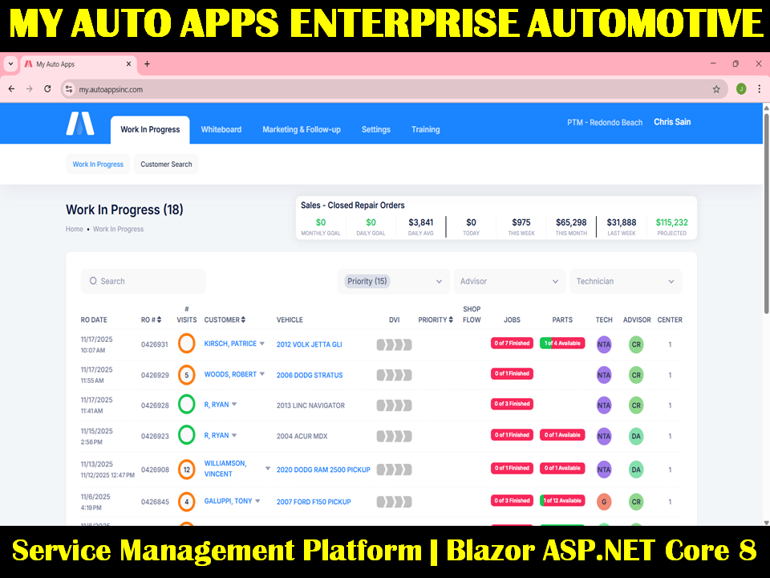
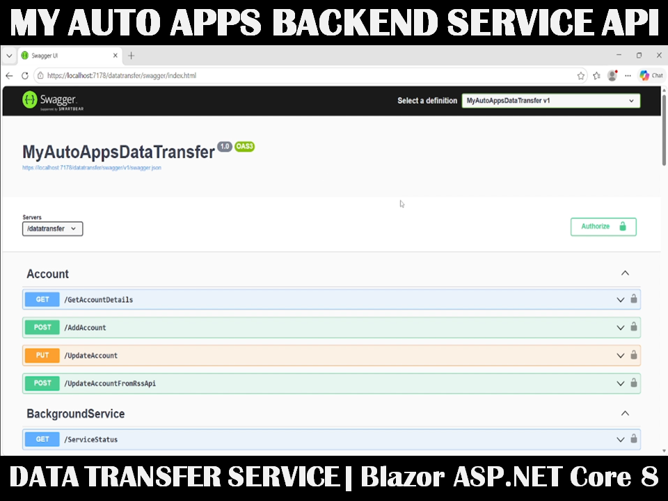
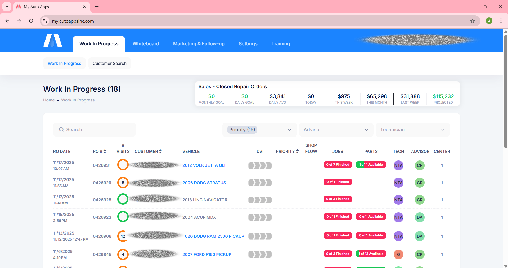
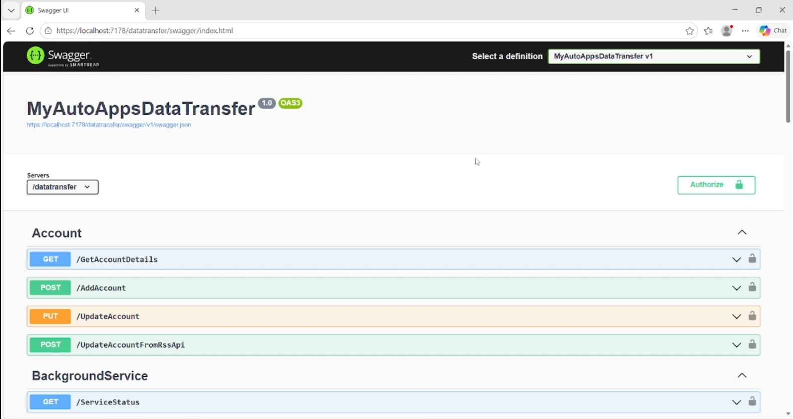
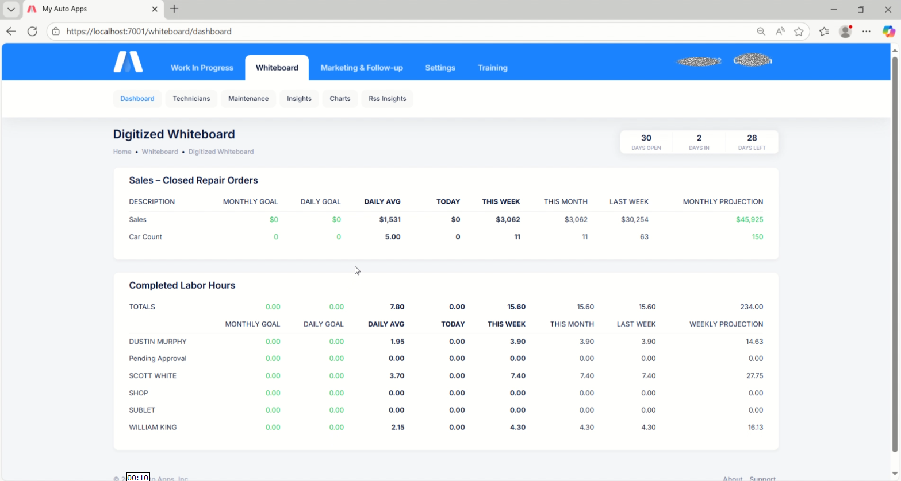
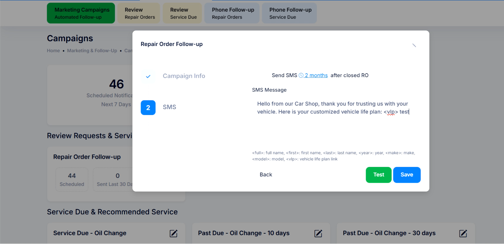
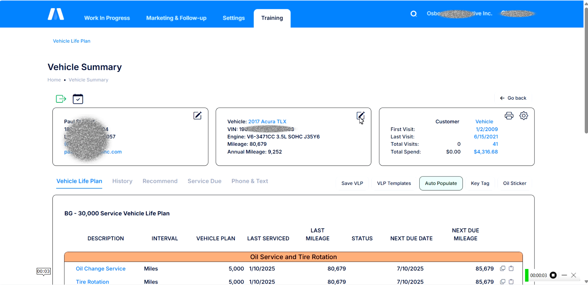
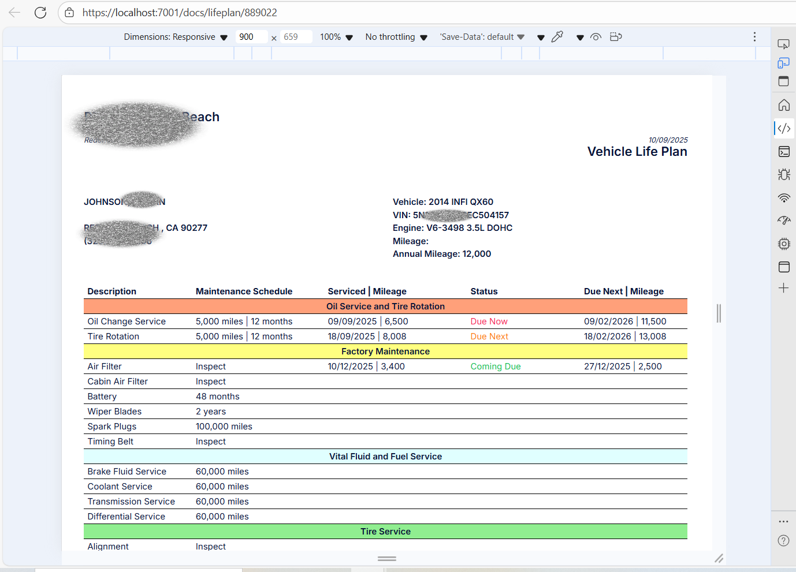

# MyAutoApps

> Enterprise automotive service management platform built with **Blazor ASP.NET Core 8**, designed to modernize legacy desktop systems into a centralized web and mobile solution.


---

# 🎥 Project Demo

> Click the image below to watch the project demo video.

<a href="https://www.youtube.com/watch?v=NFZ4fmnmCvw" target="_blank">
  
</a>

<a href="https://www.youtube.com/watch?v=SAnZfR6ik3I" target="_blank">
  
</a>

---

# 📌 Project Overview

**MyAutoApps** is a modern automotive service platform developed for **Repair Shop Solutions**, a company that provides digital workflow solutions for automotive repair shops.

The project was developed using:

- **Microsoft Visual Studio 2022**
- **Blazor ASP.NET Core 8**
- **Metronic UI Framework**
- **Swagger API Integration**

The primary objective of this project is to migrate existing legacy desktop applications into a **modern web and mobile platform**, while also improving and expanding services that were previously unavailable in the old system.

Before this migration, the company already had multiple existing systems and websites, but they were operating independently and were not connected to a centralized database. This project consolidates all services into one integrated ecosystem that supports:

- Customer inquiries
- Service management
- Employee workflow monitoring
- Repair operations
- Customer communication
- Real-time analytics and reporting

The platform helps improve operational efficiency, customer experience, transparency, and business performance for automotive repair shops.

---

# 🏢 Company

## Repair Shop Solutions

Repair Shop Solutions provides digital tools and operational software solutions for automotive repair businesses.

🌐 Website:  
https://www.repairshopsolutions.com/

---

# 🎯 Project Goals

- Migrate desktop applications into web and mobile platforms
- Centralize multiple disconnected systems into one database
- Improve customer communication and engagement
- Enhance operational monitoring and workflow management
- Provide scalable and maintainable architecture
- Modernize automotive repair shop processes
- Improve reporting and analytics capabilities

---

# 🛠️ Technology Stack

| Technology | Description |
|---|---|
| ASP.NET Core 8 | Backend Framework |
| Blazor | Front-End Framework |
| C# | Programming Language |
| Microsoft SQL Server | Database |
| PostgreSQL pgAdmin | Database |
| Entity Framework Core | ORM |
| Swagger | API Documentation & Testing |
| SignalR | Real-Time Communication |
| Metronic | Front-End UI Framework |
| Visual Studio 2022 | Development Environment |

---

# 🚀 Main Solution

## Solution Name

```bash
MyAutoApps
```

---

# 📂 Projects Under the Solution

## 1. MyAutoApps

Main web application project responsible for front-end services, business workflows, and user interactions.

### Front-End Features & Services

#### 🔐 Authentication & Authorization
- Blazor Authentication
- Role-based Authorization
- Secure Login System
- Session Management
- User Access Control

#### 🎨 UI/UX Design
- Responsive UI Design using Metronic
- Modern dashboard layout
- Mobile-friendly design
- Interactive components
- User-friendly navigation
- Real-time interface updates

#### ⚙️ CRUD Operations
Users can perform:
- Create
- Read
- Update
- Delete

for different business modules and operational workflows.

#### 📊 Operational Features
- Customer inquiry management
- Service workflow monitoring
- Employee progress tracking
- Dashboard reporting
- Real-time operational visibility
- Customer communication tools

---

## 2. MyAutoAppsDataTransfer

Backend service project responsible for data transfer operations, background services, and API transaction processing.

This project uses **Swagger API** integration to directly perform backend transactions based on the programmed services.

### Backend Features & Services

#### 🔄 BatchUpdate
- Bulk data processing
- Scheduled batch transactions
- Large-scale data synchronization

#### ⚙️ DataTransferBackgroundService
- Automated background data processing
- Service synchronization
- Scheduled transfer operations

#### 📥 IBackgroundJobQueue
- Queue-based background job management
- Asynchronous task processing
- Improved system performance

#### 📋 CopyTableService
- Database table migration
- Data replication
- Legacy system data transfer

#### 👷 BackgroundJobWorker
- Background worker execution
- Task monitoring
- Service processing automation

---

# ✨ Core System Features

## 1. Digital Vehicle Inspections (DVI)

Better inspections, informed customers, and a stronger bottom line.

Digital Vehicle Inspections help repair shops improve the inspection process while providing customers with transparent and visual reports regarding their vehicle condition.

### Features
- Digital inspection forms
- Vehicle condition reports
- Photo and video attachments
- Customer-friendly inspection summaries
- Real-time inspection tracking
- Technician workflow support

### Benefits
- Improved transparency
- Faster customer approvals
- Increased customer trust
- Higher repair order conversions

---

## 2. Desktop Texting

Contact customers directly without picking up the phone.

### Features
- Two-way customer messaging
- Service notifications
- Repair status updates
- Faster communication workflow
- Improved customer response time

---

## 3. Digital Whiteboard

Real-time operational intelligence dashboard that provides visibility into business performance and shop operations.

### Business Goals
- Increase Sales
- Increase Car Count
- Increase Productivity
- Increase Customer Retention

### Features
- Real-time operational dashboard
- Employee work monitoring
- Workflow tracking
- KPI analytics
- Productivity insights

---

## 4. Vehicle Life Plan

Vehicle Life Plan shifts the customer conversation from selling services to helping customers properly maintain their vehicles.

The system gathers maintenance information from previous repair orders and CARFAX integration to create a customized maintenance roadmap.

### Features
- Maintenance history tracking
- CARFAX integration
- Personalized service recommendations
- Customer maintenance planning
- Vehicle service roadmap

### Benefits
- Builds customer trust
- Improves customer retention
- Encourages preventive maintenance
- Enhances customer experience

---

## 5. RSS Insights

RSS Insights is a business intelligence solution developed through a cooperative effort between AutoApps and Repair Shop Solutions.

### Features
- Shop performance analytics
- Operational reporting
- Revenue tracking
- KPI dashboards
- Productivity monitoring
- Business insights for shop owners

---

# 🧩 System Architecture

```text
Legacy Desktop Systems
        │
        ▼
 Centralized Database
        │
        ▼
 ASP.NET Core 8 Platform
        │
 ┌──────┼──────┐
 ▼      ▼      ▼
Web    Mobile  Admin
App     App   Dashboard
```

---

# 📱 Platform Support

- Web Application
- Mobile Responsive
- Tablet Support
- Desktop Browser Support

---

# 📸 Screenshots

## Dashboard


## Swagger API Integration


## Digital Whiteboard


## Marketing Campaigns


## Training Vehicle Summary


## VLP Report 


---

# 🔐 Source Code Privacy Notice

> I am unable to share the source code publicly because this is a private company project.
> I am not authorized to distribute or disclose the source code due to company data privacy and security policies.

---

# 📄 License

```text
Private / Proprietary Project
```
